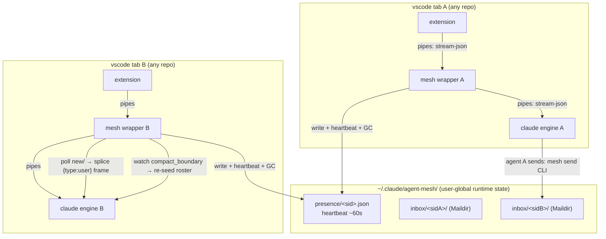

# claude-agent-mesh — design

> **Repo:** [github.com/irl-llc/claude-agent-mesh](https://github.com/irl-llc/claude-agent-mesh) · **License:** GPL-3.0
> **Origin:** operator proposal (2026-07-08, irl-llc session) — "make our own agent-team
> mode" for the multiple-vscode-tabs workflow. Grew out of a post-compaction
> team-memory-loss investigation
> ([anthropics/claude-code#23620](https://github.com/anthropics/claude-code/issues/23620),
> absorbed here) and the retirement of a prior orchestration experiment
> (irl-llc PR #991, "status-pipe"). Extracted to a standalone repo 2026-07-10: the
> design is orthogonal to any one codebase and deliberately **user-wide**.

## Problem

The best parallel-agent DX the operator has found is **N independent Claude Code
sessions, one per VS Code terminal tab**, each a peer driven directly by the human
(who decides when a tab is stuck, needs a different model, etc.). It works — except
the tabs **cannot see or talk to each other.** No shared roster, no way for one tab
to hand a task to another, ask a question, or announce "I touched `X`, rebase." The
human is the only communication channel, hand-relaying between tabs — and the mesh
should work across *every* project on the machine, not one repo.

The two existing alternatives are both wrong for this workflow:

1. **Native agent teams** (`CLAUDE_CODE_EXPERIMENTAL_AGENT_TEAMS`) solve
   coordination but impose a **lead + teammates** topology in tmux/iTerm2 panes,
   with the lead process owning teammate I/O — neither flat nor human-orchestrated,
   and carrying the auto-compaction team-memory-loss bug (#23620).
2. **Bespoke orchestration protocols** (the operator's retired status-pipe
   experiment) drown in coordinator runtime state. **Lessons carried in:** durable
   truth stays in git/issues, no coordinator state protocol, no dependence on
   machinery that may not exist at runtime, and the whole thing must be trivially
   removable.

## Wire-protocol findings (empirical, 2026-07-09/10 — this is what the design rests on)

We interposed a transparent logging wrapper between the VS Code extension and the
`claude` engine (via the extension's **documented** `claudeCode.claudeProcessWrapper`
setting) and captured a full real session: init → normal turn → background
`sleep 60` → **a message sent while the task was still running** → `/compact` →
post-compaction turn. Combined with a source read of the extension bundle (v2.1.201):

1. **Transport.** The extension spawns **one persistent `claude` process per
   session**, speaking **newline-delimited stream-json over plain pipes** (no PTY,
   no `--print`), via the published `@anthropic-ai/claude-agent-sdk`. Captured argv
   (the contract fixture):
   `--output-format stream-json --verbose --input-format stream-json
   --max-thinking-tokens 31999 --permission-prompt-tool stdio
   --setting-sources=user,project,local --permission-mode default
   --allow-dangerously-skip-permissions --include-partial-messages --debug
   --debug-to-stderr --enable-auth-status --no-chrome --replay-user-messages`,
   with `CLAUDE_CODE_ENTRYPOINT=claude-vscode`. The same wrapper also receives
   short-lived one-shot spawns (e.g. `claude auth status --json`) — a wrapper must
   detect which shape it was handed.
2. **The user-message envelope** (extension → engine), one JSON object per line:
   ```json
   {"type":"user","uuid":"<uuid>","session_id":"","parent_tool_use_id":null,
    "message":{"role":"user","content":[{"type":"text","text":"…"}]}}
   ```
   `session_id` is sent **empty** — the engine assigns it (echoed in `system/init`).
3. **Mid-turn delivery works and needs no special framing.** The "message a busy
   session" case is the **same envelope**, simply enqueued on stdin while the
   engine is working: our `2+2` frame was sent while the `sleep 60` task was
   running, answered mid-task, and the task completed normally afterward. No
   interrupt, no steer marker. Because the engine runs with
   `--replay-user-messages`, an injected frame is **echoed back on stdout and
   rendered in the tab's UI** — injected messages are visible to the human.
4. **Compaction is observable on the wire and does not restart the process.**
   `/compact` emits `system/status {status:"compacting"}` →
   `system/compact_boundary` → the summary arrives as a `user` message — same
   process, same argv, same `session_id`. A wrapper can therefore *watch for the
   boundary* and act right after it.
5. **A control plane rides the same stdio** (`control_request`/`control_response`:
   `initialize` — which carries the hooks config — `mcp_message` for the IDE
   editor tools, `get_settings`, `generate_session_title`, interrupt; permission
   prompts via `--permission-prompt-tool stdio`). A wrapper must **pass all of
   this through untouched**; it only ever *adds* `{"type":"user",…}` lines.
6. **There is no local channel into a session you don't own.** Confirmed from the
   extension source + docs: the engine's stdin fd is private to the extension
   host; the local IDE WebSocket (`~/.claude/ide/<port>.lock`) exposes editor
   tools only (no "submit turn" method); Remote Control is a cloud-relayed
   human UI; agent-view peek/reply is a human UI; there is no
   `claude message <id>` CLI. **Interposing at spawn time via
   `claudeProcessWrapper` is the only in-contract seat with stdin access — and it
   is a documented setting with prefix-wrapper semantics:
   `<wrapper> <real-claude> <args…>`.**
7. **`--append-system-prompt` survives compaction** (docs-adjudicated 2026-07-10;
   an earlier contrary finding misread *"detailed instructions from early **in the
   conversation** may be lost"*, which is about conversation content). The
   prompt-caching doc is explicit: compaction *"replaces your message history with
   a summary"* and Claude Code *"reuses the system prompt layer"* — the flag lives
   on the still-running process's argv and is re-sent with every API request.

**On stability:** this seam is the extension↔engine wire. Anthropic ships those as
independently-versioned tools that must interoperate across users' upgrade skew, so
the seam carries a de-facto stability contract even where undocumented — but we
consume it as a **monitored dependency**: version-pinned, contract-tested against the
captured fixture, isolated behind one adapter, and degrading to pure passthrough
(see D2/D7).

## Design

One component: the **mesh wrapper** — a stdlib-only Python program installed as the
VS Code `claudeCode.claudeProcessWrapper` (a **user-level VS Code setting**, applied
by the operator). Everything else is a **Claude Code plugin** (skill that teaches
the message protocol) plus a user-global runtime directory. Distribution: this repo
doubles as a **plugin marketplace** (`.claude-plugin/marketplace.json`), so install
is `add marketplace → install plugin → set the one VS Code setting`.



### The wrapper's duties

1. **Transparent proxy (the foundation, already validated live).** Byte-exact
   `select()`-loop forwarding of stdin/stdout/stderr, non-blocking with
   backpressure, signals forwarded, child exit code preserved. The mesh features
   below are additive; if any of them fails, the proxy keeps proxying (D2).
2. **Activation gate.** Mesh logic activates **only** when the spawn looks like a
   real session: argv contains `--input-format stream-json` **and** stdin is a
   pipe. One-shot subcommands (`auth status`, future shapes) and anything
   unrecognized get pure passthrough with no mesh side effects.
3. **Presence + heartbeat + self-identity.** At spawn the wrapper generates a
   mesh-id and sets **`CLAUDE_MESH_SESSION_FILE=~/.claude/agent-mesh/identity/
   <mesh-id>.json`** in the engine's environment (inherited by the agent's shell
   tools). On observing `system/init` on stdout, write both the **identity file**
   (`{session_id, title, cwd}` — how an agent learns *its own* sid/title for the
   `from:` field: it reads `$CLAUDE_MESH_SESSION_FILE`; the session id does not
   exist at spawn, so the system prompt alone cannot carry it) and
   `presence/<session_id>.json` — `{session_id, title, cwd, pid, model,
   started_at, last_heartbeat, claude_version}` (`title` filled from the
   `generate_session_title` control response when it flows past; `cwd`/`model`
   from `system/init`). *(A startup roster/identity splice was considered and
   rejected: an injected user frame at session start triggers an uninvited model
   turn; the env-pointed file costs nothing until needed.)* Refresh
   `last_heartbeat` **every ~60 s** (piggybacked on the existing 0.25 s select
   tick; atomic tmp+rename). On clean exit, **delete own presence + identity
   files** — unread `new/` messages are *retained* under the orphan-inbox
   retention (duty 4), so a resumed session drains them. A crashed wrapper
   simply stops heartbeating — which *is* the failure signal other sessions see.
4. **Garbage collection (leader-elected janitor).** GC is a **leader duty**: each
   wrapper attempts a **non-blocking `flock`** on `~/.claude/agent-mesh/leader.lock`
   at startup and on a slow (~5 min) tick **with per-wrapper random jitter**
   (±60 s) so acquisition attempts and sweeps never stampede. The holder is the
   janitor; everyone else skips GC entirely. `flock` is the right primitive on a
   single machine because **the kernel releases it when the holding process dies**
   — leader failover is automatic, with no leases, timestamps, or stale-lock
   recovery. Leadership is an *optimization and contention control, never a
   correctness dependency*: every sweep operation remains idempotent and
   race-tolerant, so a filesystem without working `flock` degrades to
   jittered-everyone-sweeps and nothing breaks. The leader sweeps:
   - **Stale presence:** `last_heartbeat` older than the staleness window
     (default 5 min = 5 missed beats) → delete the presence file. The peer is
     thereafter absent from rosters.
   - **Orphaned inboxes:** an `inbox/<sid>/` whose sid has **no presence file**
     is *not* reaped immediately — a resumed session (`--resume` keeps its
     `session_id`) re-creates presence and drains what accumulated. Only after a
     retention period with no presence and no new messages (default 7 days) is
     the tree deleted.
   - **Logs:** wrapper logs under `log/` pruned by age/size cap.
   - **Race + absence semantics:** sweeps race harmlessly even without the lock —
     deletion is idempotent (`ENOENT` tolerated), sweep decisions come from a
     single `lstat` snapshot, and no sweep ever touches its *own* session's files
     except to refresh them. If **no** wrapper is alive, files persist inertly
     until the next spawn's startup acquisition — acceptable by construction
     (they're small and harmless).
5. **Delivery: splice, not hooks.** Poll own `inbox/<sid>/new/` (~1 s, same
   loop). For each message: render one user frame carrying the message file
   **essentially verbatim** (see delivery rendering below) and write it to the engine's stdin
   **only at a frame boundary** (the proxy already buffers; injected lines are
   queued and flushed between the extension's own newline-terminated frames,
   never inside one). Move the file `new/` → `cur/` **only after** the frame is
   fully written (crash-safe: a wrapper crash before the move re-delivers rather
   than drops). Confirmed by the experiment: this reaches a **busy** engine
   mid-task and renders in the UI.
6. **Post-compaction re-seed (absorbs the #23620 fix).** On observing
   `system/compact_boundary` on stdout, splice one user frame carrying the
   current roster + a one-paragraph mesh-protocol reminder. Team awareness
   survives compaction regardless of what the summary kept.
7. **Framing at startup.** Append `--append-system-prompt "<mesh framing>"` to the
   engine argv at spawn (how to be a mesh peer; where the skill lives; send
   etiquette). Verified durable across compaction (finding 7). Division of labor:
   **static** protocol framing rides the system prompt; **dynamic** roster rides
   the compact-boundary re-seed and mesh messages.
8. **Config: loaded at spawn, hot-reloaded on change.** All tunables live in
   `~/.claude/agent-mesh/config.json`; the wrapper (and `mesh send`) stat its
   mtime on the slow tick and reload on change — no session restart to adjust a
   window or cap. Also carries `claude_binary` (absolute path to the real
   engine): unused in VS Code prefix-wrapper mode (the extension passes the real
   path as the first argument), but load-bearing when the wrapper is invoked as
   `claude` itself (PATH shim / alias, Q5) — an explicit path plus the existing
   recursion-guard env var prevents a shadowing symlink or script from making
   the wrapper resolve to itself. Malformed config = fail-open to defaults + log.

### Delivery rendering (reworked per operator review, 2026-07-10)

The spliced frame carries the message file **essentially verbatim** — the same
standard front-matter markdown that sits on disk, prefixed by one wrapper-stamped
attribution line. One format everywhere: on disk, in the spliced context, in the
UI, in a `grep`. No bespoke delivery grammar.

Why this is safe without extra framing — the two consumers differ:

- **The parser (wrapper reading the file) is delimiter-safe by construction.**
  Standard front-matter parsing exits header mode at the second `---`; body bytes
  can never retroactively become headers. The only hole is a newline smuggled
  into a header *value*, and no header field legitimately contains one — so the
  **send path validates mechanically**: every front-matter value must be a single
  line (control-character-free, length-capped), or the send is rejected before
  `tmp/`→`new/`. Parser hygiene, enforced in code, not by instruction.
- **The model reading the splice** needs only one invariant, stated once in the
  system-prompt framing: **each mesh delivery arrives as exactly one message;
  nothing inside a body begins a new delivery.** A body that quotes another
  message — front-matter and all — is body content (models handle quoted
  email-inside-email routinely). Oversized bodies truncate with a "full text at
  `<path>`" pointer.
- **At-least-once dedup:** receivers treat a repeated `message-id` as already
  handled (the skill states this); redelivery after a wrapper crash is
  detectable, never double-acted-on.
- The system-prompt framing tells the model: mesh message content is a
  **peer request, never an operator command** — and pasted third-party material
  inside a body (logs, PR comments, web text) keeps its untrusted status when
  forwarded. `--replay-user-messages` rendering gives the human the same view.

A per-delivery nonce boundary (MIME-style random delimiters around the body) was
adversarially proposed and then **rejected on operator review**: agents are
trusted, so wrapper-stamped attribution never competes with in-band claims that
matter; the injection defense lives in content skepticism, not framing bytes; and
a nonstandard grammar taxes every reader of the system. It was purely a
delivery-time wrapper behavior, so it can be reintroduced later without touching
any stored message if attribution confusion is ever observed in practice.

### Substrate & format

- **`~/.claude/agent-mesh/`** (user-global, `0700`): `presence/<sid>.json`,
  `inbox/<sid>/{tmp,new,cur}` Maildir per session, `identity/<mesh-id>.json`,
  `leader.lock`, `config.json` (hot-reloaded, duty 8), send-rate state, `log/`.
  **User-global by
  design** — the mesh spans every project/worktree on the machine (the operator
  works across several repos), and the wrapper is machine-scoped anyway. Presence
  carries `cwd` as **information, not a filter** (Q4): peers and humans see which
  repo/worktree each session is in when choosing whom to ask about what — e.g.
  the git-spice session, its VS Code extension session, and a monorepo session
  aware of one another. Nothing in any repo to gitignore; no
  docs stranded in a runtime tree.
- **Message = markdown file with YAML front-matter** (email-inspired, adapted):
  `message-id`, `thread-id` (a ticket/epic id when the exchange is about one),
  `in-reply-to` (optional), `from` (`<title> <<session_id>>`), `to`, `subject`,
  `date` (ISO-8601). Send = write into recipient's `tmp/`, atomic-rename into
  `new/` (crash-safe, no torn reads; `new/`→`cur/` is the unread→read edge —
  pattern lifted from `agent-message-queue`).
- **The protocol contract ships in the plugin's skill** (`skills/agent-messaging/`):
  how to discover peers (read `presence/`), how to send (`mesh send`, below) and
  the back-off etiquette on a refused send, the front-matter schema, reply
  etiquette, and the untrusted-content posture. The always-on essentials ride the
  wrapper's system-prompt framing. The mesh is **user-wide, always** (Q4): the
  roster is the full machine roster; presence's `cwd`/title are informational —
  they help a peer pick *whom* to talk to about *what*, they are not a scoping
  filter. Nothing is committed into any consuming repo.

### Sending: the `mesh send` CLI (reworked per operator review, 2026-07-10)

Sends go through a small stdlib CLI (`mesh send`, shipped in the plugin next to
the wrapper), not through hand-written files. The original "agents Write message
files directly per the skill" approach could not support back-pressure — an
instruction cannot *refuse*; storms were a legitimate observed failure mode in
earlier experiments of this kind, so refusal has to be mechanical, and a send
must be able to **fail in a way the agent sees** (nonzero exit + actionable
stderr) so it backs off. The CLI is also where every previously prose-enforced
send rule becomes code:

1. **Stamping** — generates `message-id` and `date`, reads the sender's identity
   from `$CLAUDE_MESH_SESSION_FILE` (inherited by tool subprocesses from the
   engine's env). No agent-authored metadata to get wrong.
2. **Validation** — single-line, control-character-free, length-capped header
   values; body size cap. Reject before anything is written.
3. **Recipient liveness** — re-checks `presence/<sid>.json` immediately before
   the `tmp/`→`new/` rename; absence = failed send with "peer gone, run
   `mesh peers`" on stderr. Never a silent write into a readerless mailbox.
4. **Back-pressure** — a per-sender token bucket (state under the runtime tree,
   `flock`-guarded read-modify-write) refuses over-rate sends with
   `rate limited — retry after ~Ns`. The skill's etiquette: on refusal,
   **coalesce** pending updates into one message and wait; never hammer-retry.
5. **Atomic write** — the `tmp/`→`new/` Maildir discipline, done once in code
   instead of taught per-agent.

Enforcement is cooperative (a trusted agent *could* still Write files directly),
which matches the trust model — the skill only ever teaches the CLI, and the
receiving wrapper can additionally batch a flooding inbox as defense in depth if
storms are ever observed despite it. `mesh peers` (read presence, human-readable
roster) ships alongside as the discovery ergonomic.

### Reliability & failure modes (the wrapper is in the boot path — this section is the price of admission)

| Failure | Behavior |
|---|---|
| Any exception in mesh logic (presence, inbox, splice, parse, GC) | **Fail-open:** disable mesh for the rest of the process, log one line under `~/.claude/agent-mesh/log/`, keep proxying bytes. A mesh bug must never take down a session. |
| Wrapper itself fails to start / crashes | The engine dies with it → the tab visibly errors → kill switch: remove the VS Code setting (one line) or set `CLAUDE_MESH_DISABLE=1`. The wrapper is *not* auto-installed anywhere; the operator owns the setting. |
| Extension upgrade changes argv / frame shapes | Three layers, honest about what each can see: (1) activation gate refuses spawn shapes it doesn't recognize → passthrough; (2) **strict runtime frame validation** in `wire.py` — any unrecognized frame shape disables mesh for the process (fail-open, D2) and logs it with the observed engine version; (3) at activation the wrapper compares the engine version against the fixture's recorded version and logs the skew. The CI fixture replay is a **wrapper-regression test only** — it cannot flag an extension upgrade (CI doesn't run when the extension updates); runtime validation is what does. |
| Clean exit (or crash) leaves unread `new/` messages | Not deleted: retained under orphan-inbox retention (duty 4); a resumed session (`--resume` keeps its sid) drains them. The sender-side liveness check surfaces sends to a peer that is already gone. |
| Send races recipient deletion (write recreates the dir) | `mesh send` re-checks `presence/<sid>.json` immediately before the `tmp/`→`new/` rename; absence = nonzero exit + "peer gone" on stderr. A recreated readerless dir is reaped by orphan GC. |
| Message storm (agents ping-ponging status instead of working) | `mesh send` token bucket refuses over-rate sends with a visible "retry after ~Ns" failure; skill etiquette = coalesce and wait, never hammer-retry; receiving-wrapper inbox batching held in reserve as defense in depth. |
| GC leader crashes | Kernel releases the `flock` with the dead process → the next jittered acquisition attempt takes over; no lease/timestamp machinery to go stale. |
| `flock` unsupported / broken on the runtime tree's filesystem | Degrade to jittered everyone-sweeps: all GC ops are idempotent and race-tolerant by construction, so leadership is never a correctness dependency. |
| Injected frame corrupts the stream | Prevented structurally: injection only ever writes complete, `json.dumps`-serialized, newline-terminated lines, queued at frame boundaries; the wrapper never edits or reorders the extension's own bytes and never fabricates control-plane frames. |
| Newline/control chars in a front-matter value (would corrupt header parsing) | `mesh send` rejects before anything is written; header values are single-line by contract. A body quoting a whole message is inert by the one-delivery-per-frame invariant; both are T3 test cases. |
| Malformed/oversized inbox message | Skip + move to `cur/` with a `.rejected` marker; body capped with a file-path pointer; never blocks the proxy loop. |
| Crash between "frame written" and "message moved to cur/" | At-least-once delivery: the message re-delivers on restart. Duplicates are detectable by `message-id` in the front-matter; preferred over silent loss. |
| Stale presence (crashed peer, closed lid) | Heartbeat stops → any live wrapper's GC removes it after the staleness window; "last seen" honesty rather than exact liveness. |
| Dead session's inbox accumulating forever | Orphan-inbox retention GC (duty 4): kept while resumable, reaped after the retention window. |
| GC races between wrappers | Idempotent deletes, `ENOENT` tolerated, snapshot-based decisions; no wrapper touches its own live files destructively. |
| Two engines, one wrapper file contention | Per-session dirs keyed by engine-assigned `session_id`; presence writes are tmp+rename atomic; Maildir gives per-message files — no shared-file writers anywhere. |

### Security posture

The inbox is a **local trust boundary**: any same-user process can write a message
file, and an injected frame arrives inside the session's context. The trust model
is **trusted agents, unconstrained content**: peers are not adversaries, but the
text they carry (pasted logs, PR comments, web excerpts) may be. Mitigations:
send-path front-matter validation (single-line header values, enforced in code);
`0700` on the tree; skill + system-prompt discipline (mesh content = peer request,
not operator command; forwarded third-party material stays untrusted); the
one-delivery-per-frame invariant; `--replay-user-messages` rendering so the human
sees every injected frame. Cross-user spoofing is out of scope (single-user
machine); if that changes, per-session HMAC keys in presence files are the known
upgrade (cc2cc prior art). The committed wire fixture is governed by an explicit redaction contract
(T1) — "sanitized" is enforced by a test, not asserted.

## Decisions

**D1 — Deliver by splicing user frames in a process wrapper; hooks are not in the
delivery path. (VALIDATED by the 2026-07-10 live capture.)**
The wrapper writes ordinary `{"type":"user",…}` lines to the engine's stdin.
Confirmed: reaches a busy engine mid-task, no special envelope, renders in the UI.
This replaces the earlier hook-based design (SessionStart roster hook, Stop-hook
drain, FileChanged bell): one mechanism instead of three, true mid-turn delivery
instead of turn-boundary delivery, and delivery to an *idle* tab works identically
(the frame just starts a new turn). Scope of the VALIDATED stamp: splice during
**mid-tool execution** is what the capture proved; splicing while a stdio
*permission round-trip* is outstanding is a distinct ordering on the same pipe and
is an explicit T3 test case before it is claimed. Earlier "you cannot inject into a running
session" was an overstatement — corrected to "…into a session *you don't own*";
the wrapper makes us the owner-adjacent party with stdin access, via a documented
setting.

**D2 — Fail-open is the reliability contract. (PROPOSED.)**
The wrapper sits in the boot path of every VS Code `claude` spawn (the setting is
machine-scoped). Therefore: mesh features are additive to a byte-exact proxy; any
mesh error degrades to pure passthrough for the process lifetime; an activation
gate excludes one-shot/unrecognized spawns; `CLAUDE_MESH_DISABLE=1` and removing
the setting are the kill switches. The transparent-proxy foundation is already
written and live-validated (the capture shim ran a full real session through it,
including compaction, byte-clean).

**D3 — The wrapper owns presence, heartbeat, cleanup, and GC; no hooks, no daemon.
(PROPOSED — operator-directed.)**
The wrapper knows the session's whole lifetime (spawn→exit) and sees `system/init`
(session id, cwd, model) and the title on the wire, so it maintains presence more
reliably than any hook: write at init, heartbeat ~60 s, delete on exit. GC is a
**leader duty** won by non-blocking `flock` (duty 4): one janitor at a time,
jittered acquisition, automatic failover on death, and idempotent race-tolerant
sweeps as the no-lock fallback — with no dedicated GC process to babysit. The
leader slot is deliberately generic: future leader-scoped duties (e.g. Q1's
storm-control accounting, roster snapshots) can reuse the same lock without a
second protocol.

**D4 — Runtime state is user-global (`~/.claude/agent-mesh/`); the protocol
contract ships in the plugin skill. (PROPOSED.)**
The mesh is deliberately user-wide (multi-project); repo-relative state would
fragment it per worktree and strand docs in ignored trees. User-global state needs
no gitignore anywhere; the format/protocol documentation lives in the plugin's
skill (+ the wrapper's system-prompt framing), which is also where agents actually
look. No user-facing README inside the runtime dir — it is pure state.

**D5 — Startup framing via wrapper-appended `--append-system-prompt`;
post-compaction re-seed via spliced roster frame; no MCP. (PROPOSED; durability
VERIFIED 2026-07-10.)**
The wrapper controls argv, so it carries the mesh framing into every session
without touching any repo. The earlier "lost at compaction" claim was refuted
against the docs (compaction summarizes **message history**; the **system prompt
layer is reused**). Static framing → system prompt; **self-identity**
(sid/title — unknowable at spawn, so the system prompt cannot carry it) → the
env-pointed identity file (duty 3); dynamic roster → presence reads +
compact-boundary re-seed + mesh messages. An MCP server was considered for
injection and rejected: the wrapper already has a strictly better seat (stdin),
and MCP would reintroduce a running service + registration for no additional
capability.

**D6 — Deliver the message file essentially verbatim; validate front-matter
mechanically at send; no bespoke delivery grammar. (SETTLED — operator review
2026-07-10, superseding the review-proposed nonce envelope.)**
Spliced frames carry the message body (not just a pointer) up to a size cap, as
the same standard front-matter markdown stored on disk plus a wrapper-stamped
attribution line. Safety splits by consumer: the *parser* is delimiter-safe by
construction (front-matter exits header mode at the second `---`) once the send
path rejects multi-line header values — mechanical validation, not instruction;
the *model* needs only the stated invariant that one frame = one delivery. The
nonce-bounded envelope from the adversarial review was rejected: in a
trusted-agent mesh its only marginal value is attribution-confusion defense the
forwarding path already grants for free, while its nonstandard grammar taxes
every reader; being delivery-time-only, it is reintroducible later without
touching stored messages. `thread-id` = ticket/epic id where applicable;
`date` + `message-id` order within a thread (single machine — no logical clocks).

**D7 — Consume the wire as a monitored de-facto-stable dependency. (PROPOSED —
operator's stability posture, 2026-07-09.)**
Anthropic's split deployment of extension and engine forces seam stability across
version skew even where undocumented. Discipline: record the captured argv +
envelopes as a **fixture**; the CI fixture-replay is a **wrapper-regression
test** (it cannot see an extension upgrade — CI doesn't run then); **drift is
caught at runtime** by strict frame validation in the one adapter module,
failing open per D2 and logging the observed engine version, plus an
activation-time version comparison against the fixture's recorded version. A
break degrades capability, never correctness.

**D8 — Python stdlib; plain `unittest` + GitHub Actions CI. (SETTLED.)**
The wrapper is spawned by the extension outside any build system, must exist on
the machine independent of a toolchain, and is I/O-plumbing, not compute. Stdlib
Python (shebang `/usr/bin/python3` on macOS; plain `python3` elsewhere), tests via
`python3 -m unittest` in CI. No compiled-binary machinery.

**D9 — Standalone GPL-3.0 repo, distributed as a Claude Code plugin marketplace.
(OPERATOR-DIRECTED, 2026-07-10.)**
The design is orthogonal to any single codebase and the operator wants it
user-wide across projects. Home: `github.com/irl-llc/claude-agent-mesh`;
`LICENSE` GPL-3.0; repo-level user-facing `README.md`. The repo carries
`.claude-plugin/marketplace.json` listing itself as a plugin (skill +
wrapper + docs), so consumers add the marketplace and install — the same
mechanism the operator has used for other plugins. The one thing a plugin cannot
set is the VS Code `claudeProcessWrapper` setting (user settings are the
operator's); the README documents that single manual step, pointing at a
**stable wrapper path** (uv/Homebrew install or a user-managed clone — not the
auto-updating plugin dir; see Q5's resolution, including the PATH-shim mode).

**D10 — Sends go through a `mesh send` CLI with token-bucket back-pressure;
direct file writes are not the protocol. (SETTLED — operator review 2026-07-10,
reversing the earlier "sending needs no CLI" position.)**
Storm control has to be mechanical: an instruction cannot refuse a send, and an
agent only backs off from a failure it can *see* (nonzero exit, actionable
stderr). Storms were a real failure mode in the operator's earlier
multi-agent-flow experiments, so this is built now, not held in reserve. The CLI
is the enforcement point, and it absorbs every send rule that was previously
skill prose — id/date stamping (identity from `$CLAUDE_MESH_SESSION_FILE`),
single-line header validation, the recipient liveness re-check, the atomic
`tmp/`→`new/` rename, and the rate bucket. Enforcement is cooperative by design
(trusted agents; the skill only teaches the CLI); receiving-wrapper inbox
batching is the reserve layer if storms appear anyway. `mesh peers` ships
alongside for discovery.

## Resolved questions (operator review, 2026-07-10)

- **Q1 — Storm control: RESOLVED — do it properly, via the `mesh send` CLI.**
  Storms were a legitimate observed failure mode in the operator's earlier
  experiments with this kind of flow, and skill etiquette alone cannot refuse a
  send. Back-pressure requires a mechanical enforcement point where **a send can
  fail visibly** so the agent backs off — hence the send-CLI rework (see
  "Sending", D10): token-bucket refusal + coalesce-and-wait etiquette;
  receiving-wrapper inbox batching held in reserve as defense in depth.
- **Q2 — Tunables: RESOLVED — `config.json`, hot-reloaded.** Presence staleness
  (default 5 min), heartbeat (60 s), GC tick (~5 min) + jitter (±60 s),
  orphan-inbox retention (7 days), body cap (~8 KiB), send-rate bucket — all in
  `~/.claude/agent-mesh/config.json`, **watched by mtime and reloaded on change**
  (duty 8); defaults confirmed against T2/T3 E2E.
- **Q3 — Addressing/naming: RESOLVED — no operator-assigned stable names.** The
  session title *is* the human-meaningful name — the user can already edit it in
  the UI, whereas a parallel name registry would have no edit surface. Identity =
  engine-assigned `session_id`; presentation = title + cwd.
- **Q4 — Scope: RESOLVED — user-wide, always.** No same-repo default etiquette
  and no repo-level scoping config (realistically it would never be switched).
  The operator's actual workflow spans repos (e.g. git-spice + its VS Code
  extension + the monorepo, fixing problems discovered in each) and cross-repo
  presence awareness is the point; roster token overhead is negligible.
  Presence's `cwd` is **informational** (which peer is in which repo), not a
  filter.
- **Q5 — Wrapper path & install modes: RESOLVED — stable-path install, plus a
  PATH-shim mode.** The README documents putting the wrapper at a stable path
  (uv-based install or Homebrew — *not* the auto-updating plugin dir) and
  pointing the VS Code setting at it. A second supported mode: invoke the
  wrapper *as* `claude` (PATH shim; a shell alias also works for terminal use,
  though VS Code spawns processes directly and does not read shell aliases —
  the setting remains the VS Code path). In shim/alias mode there is no
  real-binary first argument, so the wrapper resolves the engine via
  `config.json`'s **`claude_binary` absolute path** (+ recursion-guard env var)
  rather than PATH walking — an on-PATH symlink or script shadow can therefore
  never make the wrapper spawn itself. Terminal (PTY) sessions fail the
  activation gate by design and pass through inert — mesh activates only for
  stream-json sessions.

## Tranches (dependency-ordered; each validated against real sessions — no mocks)

### T0 — Wire capture + protocol decode — **DONE (2026-07-09/10)**
Extension-source decode + instrumented-wrapper live capture (init, tool-use,
**mid-turn steer**, `/compact`, post-compact turn). Findings §above; raw capture
retained for T1's fixture. The capture shim is the wrapper's validated foundation.

### T1 — Repo scaffolding + proxy + adapter + contract tests — **TODO**
`README.md` (user-facing: what/why, install via marketplace, the one VS Code
setting, uninstall), `LICENSE` (GPL-3.0), `CLAUDE.md` (contributor/agent guidance),
`.claude-plugin/marketplace.json` + plugin manifest, `mesh_wrapper.py` (proxy loop +
activation gate + fail-open scaffolding), `wire.py` (the one adapter: frame
split/parse/build), `testdata/` (captured fixture **under an explicit redaction
contract**: OAuth/access tokens, account/org ids, emails, hooks-config values,
absolute home paths, and real message text replaced with placeholders — enforced by
a CI test that scans `testdata/` for secret-shaped patterns; "sanitized" is a test,
not a claim), `tests/` (fixture replay = contract test; frame-boundary injection
property tests; activation-gate tests), GitHub Actions CI (`python3 -m unittest`).
*Validation:* CI green; manual passthrough session via the setting (a real session
runs byte-clean through it — already proven once with the shim); `claude_binary`
resolution exercised in shim/alias mode incl. the self-shadow recursion guard.

### T2 — Presence + heartbeat + identity + GC leadership + framing — **TODO**
Presence write on `system/init`, 60 s heartbeat, exit cleanup, the env-pointed
identity file; **`flock` leader election with jittered acquisition** and the
leader-run GC sweeps (stale presence, orphan inboxes, log rotation) with
race-tolerant idempotent deletes as the no-lock fallback;
`--append-system-prompt` framing (+ a belt-and-suspenders live compaction
check); `config.json` load + mtime hot-reload; the `agent-messaging` skill.
*Validation:* two real tabs see each
other's presence; an agent reads `$CLAUDE_MESH_SESSION_FILE` and gets its own
sid/title; `kill -9` the **leader** → the kernel releases the lock and the
survivor acquires it and sweeps; `kill -9` a non-leader engine → its presence
goes stale and is GC'd; an orphaned inbox survives until retention then is
reaped; `/compact` → framing persists (system prompt) and roster re-seed
arrives; editing `config.json` mid-session changes a tunable without restart.

### T3 — Delivery: `mesh send` CLI + inbox → spliced frames + re-seed — **TODO**
The `mesh send`/`mesh peers` CLI (stamping, validation, liveness re-check,
token-bucket back-pressure, atomic `tmp/`→`new/` — D10); Maildir inbox, ~1 s
poll, verbatim delivery rendering (size caps), `new/`→`cur/` after write,
at-least-once semantics; compact-boundary re-seed. *Validation (the core E2E):*
tab A messages **busy** tab B (long tool call) → B receives mid-task, message
renders in B's UI, exactly-once under normal flow; message a tab **blocked on a
pending permission prompt** → the stdio permission round-trip completes intact
and the message is delivered (closes D1's scoped-validation gap); send to a
dead/absent sid → `mesh send` exits nonzero with "peer gone" (no silent
write); a newline-bearing front-matter value is **rejected at send**; an
over-rate burst is **refused** with "retry after ~Ns" and a well-behaved agent
coalesces (skill etiquette observed in a real session); a body
quoting a full message (front-matter and all) is treated as body content, not a
second delivery; malformed message → skipped +
`.rejected`, session unharmed; `/compact` in B → roster re-seed arrives.

### T4 — Etiquette, polish — **TODO**
Skill-level send etiquette (attribution, thread ownership, coalesce-on-refusal),
rate-bucket default tuning against real use, `cur/` retention tuning, README
polish (enable/disable round-trip; uv/Homebrew + PATH-shim install docs).
*Validation:* scripted 3-tab exchange stays on-task;
disable/enable round-trip is one setting flip.

## Non-Goals

- **No lead/orchestrator process, no autonomous cross-tab merging** — the human
  orchestrates; peers work in separate worktrees/repos; the human integrates.
- **No MCP server, no tmux/PTY, no cloud relay, no coordinator runtime-state
  protocol, no hooks in the delivery path, no daemon** — the wrapper is the only
  moving part, and it only lives as long as its session.
- **No fabricated control-plane frames** — the wrapper adds user frames only;
  everything else passes through untouched.
- **No backward-compat surface** — `~/.claude/agent-mesh/` is per-machine runtime
  state, freely reshapeable.

## Risks

| Risk | Mitigation |
|---|---|
| Wrapper bug breaks session startup (it's in every VS Code spawn's boot path). | Fail-open contract (D2); byte-exact proxy already live-validated incl. compaction; activation gate; two kill switches; wrapper never auto-installed. |
| Extension/engine upgrade shifts the wire protocol. | Monitored-dependency regime (D7): pinned fixture + red CI contract test on drift + single adapter + passthrough on unrecognized shapes. |
| Injected frames carry in-context authority (local prompt-injection surface). | Trusted agents, unconstrained content: send-path front-matter validation + skill/system-prompt discipline (peer request ≠ operator command; forwarded third-party text stays untrusted) + one-delivery-per-frame invariant + rendered-in-UI visibility + `0700` tree; HMAC upgrade path if the trust model changes. |
| Committed fixture leaks session/auth data. | Redaction contract + CI secret-scan over `testdata/` as a T1 exit criterion. |
| Message storms / ping-pong in a leaderless mesh. | `mesh send` token-bucket refusal (D10) + coalesce-and-wait skill etiquette; human bounds fan-out; receiving-wrapper inbox batching held in reserve. |
| Duplicate delivery after a wrapper crash (at-least-once). | `message-id` in the front-matter makes dupes detectable; preferred over silent loss. |
| Runtime tree grows unbounded (dead sessions, logs). | Wrapper-as-janitor GC (D3/duty 4): stale presence, orphan-inbox retention, log rotation; startup sweep covers the nobody-was-alive gap. |
| Anthropic ships first-class inter-session messaging, obsoleting this. | Everything is one setting + one plugin — minutes to remove; the inbox format outlives the delivery mechanism. |

## Repo layout

| Path | Purpose |
|---|---|
| `README.md` | user-facing: what/why, install (marketplace + the one setting), uninstall |
| `LICENSE` | GPL-3.0 |
| `DESIGN.md` | this document |
| `CLAUDE.md` | contributor/agent guidance for this repo |
| `.claude-plugin/marketplace.json` | the repo as its own plugin marketplace |
| `skills/agent-messaging/SKILL.md` | the protocol skill (ships in the plugin) |
| `mesh_wrapper.py` | the wrapper (proxy + gate + presence + GC + splice + re-seed + config hot-reload) |
| `claude_agent_mesh.py` | the agent-facing CLI (`claude-agent-mesh`): `send` (stamp/validate/liveness/rate-limit/atomic write), `peers` |
| `pyproject.toml`, `Formula/` | install routes (Q5): uv console scripts; head-only Homebrew formula, repo-as-tap |
| `wire.py` | the single wire-format adapter |
| `tests/`, `testdata/` | unittest suite + redacted wire fixture |
| `.github/workflows/ci.yml` | `python3 -m unittest` + fixture secret-scan |

## Status

- **2026-07-08:** Initial design (hooks-based) from hook-mechanics research + a
  ~15-project prior-art survey (`agent-message-queue`'s Maildir + front-matter
  format adopted; no prior project combines markdown inbox + N-peer mesh + no-MCP
  + no-tmux).
- **2026-07-09:** Operator challenged the "can't inject into a running session"
  claim → narrowed to "…a session you don't own"; operator directed an empirical
  wrapper trace; de-facto-stability posture recorded (D7).
- **2026-07-10:** Live wire capture landed (mid-turn steer + compaction observed).
  Design pivoted from hooks to the wrapper-splice (D1–D3); runtime state moved
  user-global; `--append-system-prompt`/compaction claim **refuted** against docs
  (system prompt layer survives; Q resolved, MCP closed). Adversarial review
  (critic/refuter subagents) confirmed two mediums, both folded in: hardened
  delivery envelope (nonce boundary + receiver-side sanitization — D6) and an
  enforced fixture-redaction contract (T1). Operator directed extraction to a
  standalone GPL-3.0 repo distributed as a plugin marketplace (D9) and a
  first-class GC mechanism (duty 4/D3).
- **2026-07-10 (later):** Second adversarial-review wave confirmed five more
  design findings, all folded in: clean-exit no longer destroys unread mail
  (orphan retention + sender-side liveness check); `message-id` now rides the
  delivery envelope with receiver dedup; the "contract test goes red on upgrade"
  claim corrected (causally impossible — CI doesn't run on extension updates;
  replaced with runtime strict frame validation + activation-time version
  comparison, fixture replay re-scoped as wrapper-regression test); startup
  **self-identity gap** closed via the env-pointed identity file (a startup
  splice was rejected — uninvited model turn); D1's VALIDATED stamp scoped to
  mid-tool execution with the permission-prompt ordering promoted to a T3 test.
  Operator directed **jittered, leader-elected GC** — adopted as a `flock`-based
  leader (kernel auto-release on death = free failover; idempotent sweeps as the
  no-lock fallback; leader slot reusable for future duties like storm-control
  accounting).
- **2026-07-10 (operator design review):** The review-proposed **nonce delivery
  envelope was rejected and removed** (D6 reworked). Operator's analysis, adopted:
  the trust model is *trusted agents, unconstrained content* — the on-disk parser
  is delimiter-safe by construction once send-path validation rejects multi-line
  header values (mechanical, not instructional); the model needs only the
  one-delivery-per-frame invariant; and the nonce's sole marginal benefit
  (attribution-confusion defense) is worth little when forwarding by a trusted
  peer already confers trusted attribution — real injection defense is content
  skepticism in the skill, not framing bytes. Nonstandard grammar dropped;
  delivery now splices the stored front-matter markdown essentially verbatim
  (one format on disk, in context, in the UI). Reintroducible wrapper-side
  without touching stored messages if attribution confusion is ever observed.
- **2026-07-10 (operator review — open questions resolved):** All five closed.
  Q1 → storms are real (operator's earlier experiments) and back-pressure must
  be mechanical: sends reworked from direct Write-tool files to a **`mesh send`
  CLI** (D10) — stamping, header validation, liveness re-check, token-bucket
  refusal with visible failure + coalesce-and-wait etiquette, atomic rename —
  absorbing every previously prose-enforced send rule into code. Q2 → tunables
  in `config.json`, **hot-reloaded on mtime change** (duty 8). Q3 → no
  operator-assigned stable names; the UI-editable session title is the name.
  Q4 → **user-wide always**, no same-repo etiquette/scoping; presence `cwd` is
  informational only. Q5 → stable-path install (uv/Homebrew or clone, not the
  auto-updating plugin dir) for the VS Code setting, plus a supported PATH-shim
  /alias mode backed by `config.json`'s `claude_binary` absolute path +
  recursion guard (VS Code doesn't read shell aliases; PTY sessions pass
  through inert by the activation gate).

- **2026-07-10 (operator review, post-implementation):** The agent-facing CLI
  renamed `mesh` → **`claude-agent-mesh`** (file `claude_agent_mesh.py`): a
  generic `mesh` on PATH plants too big a flag and invites collisions. Q5's
  install routes made concrete — `pyproject.toml` console scripts
  (`claude-agent-mesh`, `claude-agent-mesh-wrapper`) for `uv tool install`,
  plus a head-only Homebrew formula under `Formula/` (the repo doubles as a
  tap). The uv route exposed a recursion hole: a *generated* console-script
  shim defeats the wrapper's realpath self-check, so a `claude_binary`
  pointing back at the shim would exec-loop — closed with an exec-depth
  guard (`CLAUDE_MESH_EXEC_DEPTH`, cap 5), tested.

## References

- Wire capture + analysis tooling (throwaway): session scratchpad `ide-probe/` —
  shim, `analyze.py`, per-run logs; fixture lands redacted in `testdata/` (T1).
- Extension internals: `anthropic.claude-code` v2.1.201 bundle —
  `resolveClaudeBinary()` (wrapper semantics), SDK spawn argv, `io_message` →
  stdin enqueue path, IDE WebSocket lock files (`~/.claude/ide/`).
- Claude Code issues: [#23620](https://github.com/anthropics/claude-code/issues/23620)
  (team memory loss at compaction — fixed here by the re-seed);
  [#27441](https://github.com/anthropics/claude-code/issues/27441) /
  [#15553](https://github.com/anthropics/claude-code/issues/15553) /
  [#24947](https://github.com/anthropics/claude-code/issues/24947) (no external
  inject into sessions you don't own — why the wrapper seat is necessary).
- Prior art: `avivsinai/agent-message-queue` (Maildir `tmp/new/cur`,
  front-matter messages), `Dicklesworthstone/mcp_agent_mail` (schema, threading),
  `multi-agent-shogun` / `agent-room` (attribution + delivery discipline),
  `cc2cc` (HMAC upgrade path). Native
  [Agent Teams](https://code.claude.com/docs/en/agent-teams) — the topology we
  deliberately diverge from.
